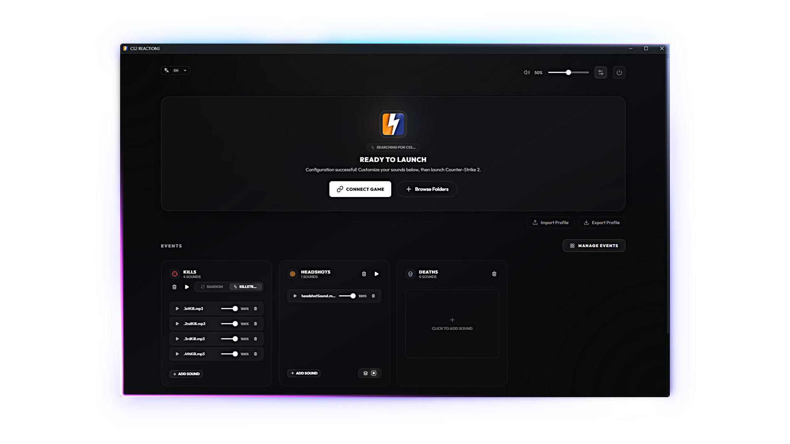

<p align="center">
  
</p>

# CS2 Reactions

A small tool I built because I always wanted custom sounds playing on kills in
competitive and killstreak audio in deathmatch, and there was never a simple way
to do that. So I built it!

## Preview

<p align="center">
  
</p>

## Install

Grab the latest installer from the [latest release](https://github.com/yopoko2/CS2-Reactions/releases/latest) and run it. Windows Defender may
flag it as a false positive caused by the global hotkey hook. Source code is
available if you want to verify.

Once installed, open CS2 then CS2 Reactions. Click "Link to CS2" to install the
game config. If that fails, use "Browse Folders" and point at your CS2 folder.
If sounds don’t fire, relaunch CS2. After an app update, if things were working
before, try **Relink** in settings so the game and the app stay in sync.

## Features

- Custom sounds per event (headshot, kill, bomb plant, round end, match end, etc.)
- Per-weapon sound triggers, covers most CS2 weapons
- Random or sequential playback, sequential mode is labeled "Killstreak" and
  plays sounds in order as your streak grows, resetting on death
- Reorder sounds on each card (drag the handle on the left of each row)
- Sound profile system (.CSreact) for importing and exporting profiles
- Modifiable global mute hotkey
- Runs in the system tray, autostart optional
- Utility and fun settings (auto-trimming silence, pitch variation, etc.)
- Available in English, Russian, Portuguese, French, and Simplified Chinese.
  Defaults to your OS language on first launch, override anytime in settings.

## Bundled presets

- **Valorant SFX** (`preset-sfx-valorant.CSreact`) — Valorant SFX pack (headshot ping, kill chain ticks, spike plant/defuse, victory).
- **Female CS 1.6 voice** (`preset-voice-female-cs16.CSreact`) — classic "sexy voice" killstreak lines many CS 1.6 servers used.
- **Unreal Tournament announcer** (`preset-voice-unreal-tournament.CSreact`) — UT announcer pack (First Blood, Double Kill, Multi Kill, M-M-M-MONSTER KILL, etc.).

## Expected behavior (not bugs)

| Topic | Details |
|---|---|
| **First kill after launch** | Most of the time, the first kill right after starting the app/connecting GSI does not trigger. This comes from startup sync/timing edges in CS2 GSI. |
| **Reaction timing** | Sound playback is near-real-time but not frame-perfect, because events come from GSI HTTP updates. |
| **Dead / spectator handling** | Intended behavior is to mute kill-style reactions while you are dead or spectating other players to prevent false triggers. There are still edge cases where this can misfire; this is still being tuned. |

## Tips

| Topic | Details |
|---|---|
| **Adding sounds** | Use **Add sound** on a card, drop audio files onto a card, or drop a **.CSreact** profile anywhere on the window. |
| **Profiles** | **.CSreact** packs your settings and sound files. Export from the app, share the file, and the other person can import it. |
| **Order of sounds** | Top to bottom on the card. **Killstreak** mode follows that order. When you add several files at once, they’re sorted A–Z and added under what you already had—reorder anytime by dragging. |

## Privacy

Everything runs locally. GSI sends data to 127.0.0.1 only. No accounts, no
telemetry, no network requests outside your machine.

## How it works

Counter-Strike 2 can send **Game State Integration (GSI)** updates to your own
PC over HTTP. This app runs a small listener (it picks the first free port in
the range **27532–27537**), reads those updates, and plays your sounds when the
state matches an event you configured.

That keeps everything official-side: no reading game memory, no hooking the
process—only the same kind of data streaming tools have used for years. The
tradeoff is a bit of delay versus cheats-level hooks, and very occasionally the
game omits or delays a stat this app cares about. The only file written inside
CS2 is the GSI config in `game\csgo\cfg\`.

## Files

The app stores your config and sounds under: 

%APPDATA%\com.cs2reactions.app\

It also writes one file into your CS2 installation:

game\csgo\cfg\gamestate_integration_cs2reactions.cfg

Uninstalling the app does not remove either of these. Delete them manually if
you want a clean removal.

## Troubleshooting

**Blank window on launch** — install WebView2 from microsoft.com/en-us/edge/webview2.

**GSI not working / no sounds** — Open **Settings → GSI & Maintenance** and note the port listed there. If you restarted the app and sounds stopped, use **Relink** or **Repair** so CS2’s config matches that port. The app tries several ports if the default is busy; only one program should own that listener—close a duplicate copy of this app or another GSI tool, then try again.

**Defender blocking install or startup** — add an exclusion for the app in
Windows Security settings.

## Limitations

- Feedback is tied to GSI timing—fine for reactions, not frame-perfect
- The listener needs a free slot in a fixed port range; you can’t type a custom port. If the app isn’t on the default, **Relink** after install or restart
- Playing many loud clips at once can clip your output

## Building from source

Requires Rust (stable), Node.js 18+, Tauri CLI. The frontend build runs
automatically through Tauri so you don't need to run it separately.

```bash
git clone https://github.com/yopoko2/CS2-Reactions
cd CS2-Reactions
npm install
npm run tauri build
```

## License

MIT
